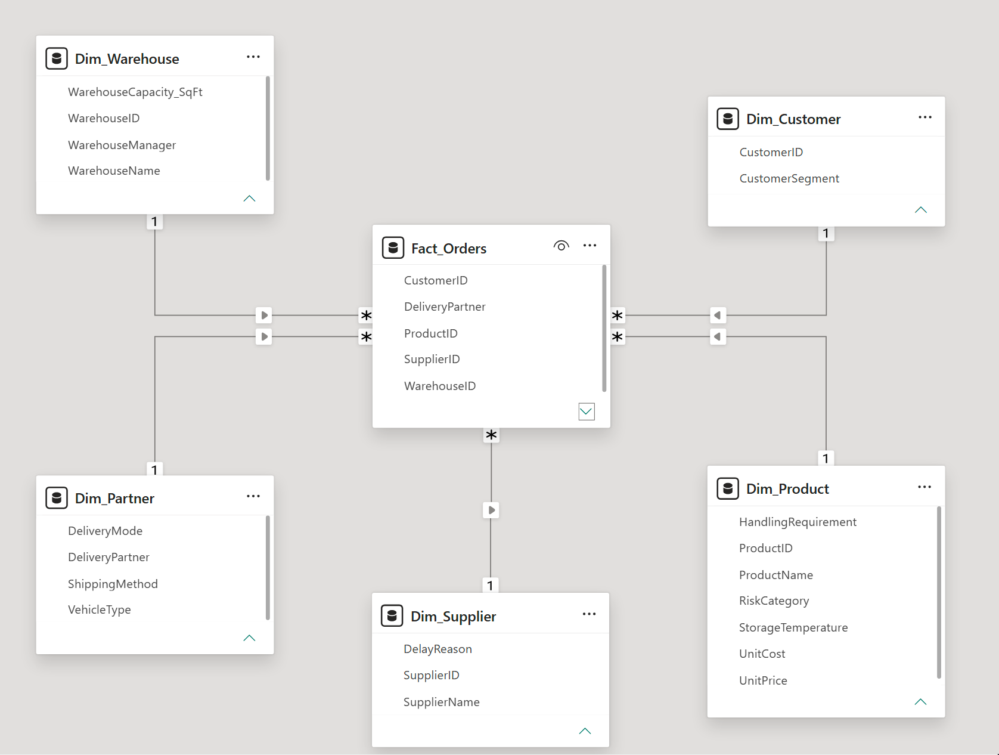
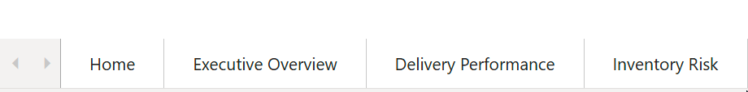

# Enterprise Supply Chain & Logistics Analytics

Interactive Power BI and SQL-based analytics project designed to monitor logistics operations, delivery performance, inventory risks, and supply chain efficiency across a simulated enterprise e-commerce environment.

---

# Project Status

This project is currently under active development.

## Completed
- Star schema data model
- KPI definitions and business logic
- Power BI data modeling
- Initial dashboard architecture
- Documentation and analytical framework

## In Progress
- Executive dashboard visualizations
- Delivery performance analytics
- Inventory risk reporting
- Advanced DAX measures

---

# Business Problem

Large-scale supply chain operations generate complex operational and logistics datasets across warehouses, suppliers, delivery partners, and customer fulfillment channels.

Without centralized visibility, management teams struggle to:
- Identify delivery bottlenecks
- Monitor carrier SLA performance
- Detect inventory stockout risks
- Reduce shipping costs
- Monitor supplier reliability
- Track damaged and returned orders

This project was designed to provide centralized operational reporting and KPI monitoring through an interactive analytics platform.

---

# Data Model Architecture

The project follows a Star Schema design with a centralized fact table and supporting dimensions.



---

# Dashboard Structure



### Executive Financial Overview
- Revenue trends
- Profitability analysis
- Shipping cost monitoring

### Delivery Performance Analytics
- SLA compliance
- Delay root-cause analysis
- Carrier performance monitoring

### Inventory & Warehouse Risk
- Stockout risk analysis
- Supplier reliability tracking
- Warehouse inventory monitoring

---

# Key KPIs

## On-Time Delivery %

```text
(Total On-Time Orders / Total Orders) * 100
```

Target Benchmark: 85%+

---

## Net Profit

```text
Revenue - (Item Cost + Shipping Cost)
```

---

## Net Profit Margin %

```text
(Total Net Profit / Total Revenue) * 100
```

---

## Product Damage Rate %

```text
(Damaged Orders / Total Orders) * 100
```

---

## Return Rate %

```text
(Returned Orders / Total Orders) * 100
```

---

# Technology Stack

- Power BI
- DAX
- SQL
- Star Schema Modeling
- Excel / CSV Data Processing

---

# Repository Structure

```text
01_raw_data/              -> Dataset notes and raw data references
02_powerbi_dashboard/     -> Power BI dashboard files
03_documentation/         -> Business requirements and architecture docs
04_assets/                -> Screenshots and project visuals
```

---

# Planned Enhancements

- Interactive executive KPI dashboards
- Advanced DAX calculations
- Operational trend analysis
- Inventory risk alerting
- Drill-through order-level reporting

---

# Limitations

- Dataset is simulated and intended for portfolio demonstration purposes
- Dashboard currently focuses on historical operational analysis
- External variables such as weather and macro demand conditions are not yet incorporated

---

# Author

Manan Agarwal  
University of Alberta — Computing Science & Mathematics